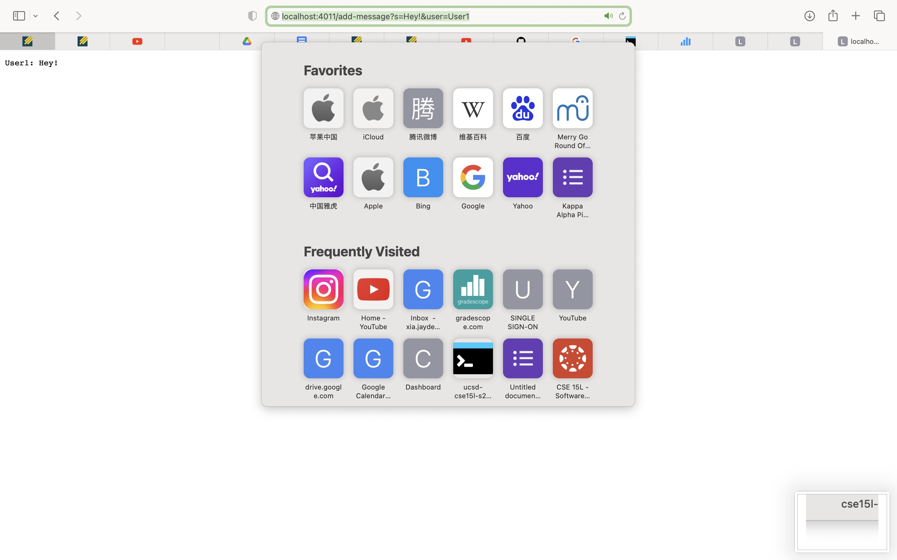

# Lab 2 

## Part 1:
### `ChatServer` Server Contents With Helper Method `StringHandler`

```
class StringHandler implements URLHandler {
    List<String> lines = new ArrayList<>();
    public String handleRequest(URI url){
        if (url.getPath().equals("/")){
            String toBeShown ="";
            for (String line:lines){
                toBeShown += line + "\n";
            }
            return toBeShown;
        }
        String query = url.getQuery();
        if (url.getPath().equals("/")) {
            return null;
        }
        if (query==null){
            return "use /add-message to chat";
        }
        String[] queries = query.split("&");
        if (url.getPath().equals("/add-message")) {
            if (queries[0].startsWith("s=")) {
                String toAdd = queries[0].split("=")[1];
                if (queries[1].startsWith("user=")){
                    toAdd = queries[1].split("=")[1] + ": " + toAdd;
                    lines.add(toAdd);
                    String toBeShown ="";
                    for (String line:lines){
                        toBeShown += line + "\n";
                    }
                    return toBeShown;
                }
                else{
                    return "must include user query parameter user =";
                }
            }
        else {
          return "Chatting requires a query parameter /add-message\n";
        }
      }
        return null;
    }
}
class ChatServer {
    public static void main(String[] args) throws IOException {
        if(args.length == 0){
            System.out.println("Missing port number! Try any number between 1024 to 49151");
            return;
        }

        int port = Integer.parseInt(args[0]);

        Server.start(port, new StringHandler());
    }
}
```

### Chat Server Examples
1.


a. I utilize a `main` method and a method called `handleRequest`.

b. The `main` method takes in an integer to create a port. The `handleRequest` method takes in a url as an argument. For this example, the `main` method took in the integer 4011 to create a port at this address. The `handleRequest` took in the url. "http://localhost:4011/add-message?s=Hey!&user=User1". The class field `lines` holds all of the chat logs of this server. 

c. This request changed the `URI` url to "http://localhost:4011/add-message?s=Hey!&user=User1" and the `lines` field, which was previously empty,  to include the `String` "User1: Hi!".

2.


a. I utilize a `main` method and a method called `handleRequest`.

b. The `main` method takes in an integer to create a port. The `handleRequest` method takes in a url as an argument. For this example, the `main` method took in the integer 4011 to create a port at this address. The `handleRequest` took in the url. "http://localhost:4011/add-message?s=Hi!&user=User2". The class field `lines` holds all of the chat logs of this server. 

c. This request changed the `URI` url to "http://localhost:4011/add-message?s=Hi!&user=User2" and the `lines` field, which previously had the `String` "User1: Hi!" to include the `String` "User2: Hey!".

## Part 2

1. .jpg)

2. 

3. 

## Part 3

I didn't know that urls and an internet brower's search tools could be used to manipulate code. I thought that the integration of CS principles I'm learning in my classes being tied to my everyday applications of the web was very interesting.
