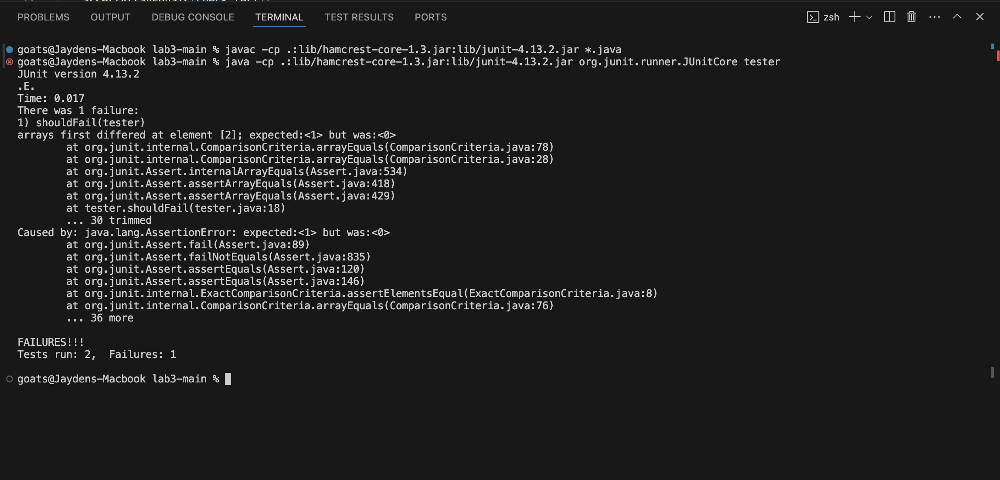

# Part 1:
1. A failure-inducing input:
```
 @Test
    public void shouldFail(){
    int[] check = {1,0,1,0};
    int[] test = {0,1,0,1};
    ArrayExamples.reverseInPlace(test);
    assertArrayEquals(check,test);
    }
```
2. No failure:
```
@Test
    public void shouldPass(){
    int[] check = {0,0,0,0};
    int[] test = {0,0,0,0};
    ArrayExamples.reverseInPlace(test);
    assertArrayEquals(check,test);
    }
```
3. Symptom:


4. Before and After:
Before:
```
static void reverseInPlace(int[] arr) {
    for(int i = 0; i < arr.length; i += 1) {
      arr[i] = arr[arr.length - i - 1];
    }
  }
```
After:
```
static void reverseInPlace(int[] arr) {
    for(int i = 0; i < arr.length/2; i += 1) {
      int temp = arr[i];
      arr[i] = arr[arr.length - i - 1];
      arr[arr.length - i - 1] = temp;
    }
  }
```
5. Fix: The original codeblock works as intended until the for loop reaches arr.length/2. At this point, the arr[i] will be pointed toward indexes that have already had their values changed. To fix this, I am swapping the values, moving from the most extreme ends of the array to the center. This for loop will iterate until i reaches the middle index of the array. Thus, the arr[i] will not be pointing to already changed values.

# Part 2:
1. 
```
goats@Jaydens-Macbook technical % grep -l "suppose" biomed/*.txt
biomed/1471-2105-3-14.txt
biomed/1471-2105-3-23.txt
biomed/1471-2105-4-26.txt
biomed/1471-213X-1-11.txt
biomed/1471-213X-3-7.txt
biomed/1471-2148-2-15.txt
biomed/1471-2180-2-32.txt
biomed/1471-2202-2-1.txt
biomed/1471-2202-2-10.txt
biomed/1471-2288-2-11.txt
biomed/1471-2288-2-4.txt
biomed/1471-2350-4-2.txt
biomed/1471-2407-2-17.txt
biomed/1471-2415-3-4.txt
biomed/1471-2458-2-25.txt
biomed/1472-6793-2-18.txt
biomed/1472-6807-2-1.txt
biomed/1472-6882-1-10.txt
biomed/1472-6882-3-1.txt
biomed/1472-6947-2-4.txt
biomed/1472-6963-3-14.txt
biomed/1476-511X-1-2.txt
biomed/bcr635.txt
biomed/cc1495.txt
biomed/cc1498.txt
biomed/gb-2000-1-2-research0003.txt
biomed/gb-2001-2-8-research0031.txt
biomed/gb-2001-3-1-research0005.txt
biomed/gb-2002-3-12-research0082.txt
biomed/gb-2002-3-3-research0011.txt
biomed/gb-2002-3-5-research0025.txt
biomed/gb-2002-3-9-research0048.txt
biomed/gb-2003-4-5-r34.txt
biomed/gb-2003-4-9-r57.txt
```
This command is searching each of the txt files within the biomed folder to find the word "suppose" and listing which files contain the word suppose. This is useful to find text files of relevance to a certain topic. 

2. 
```
goats@Jaydens-Macbook technical % grep -l "germ" plos/*.txt
plos/journal.pbio.0020012.txt
plos/journal.pbio.0020043.txt
plos/journal.pbio.0020053.txt
plos/journal.pbio.0020100.txt
plos/journal.pbio.0020121.txt
plos/journal.pbio.0020183.txt
plos/journal.pbio.0020213.txt
plos/journal.pbio.0020311.txt
plos/journal.pbio.0020347.txt
plos/journal.pbio.0030021.txt
plos/pmed.0020103.txt 
```
This command is searching each txt file within the plos directory to find which text files include the word "germ," which may be useful to find article regarding diseases.

3. 
```
goats@Jaydens-Macbook technical % grep -w "unfounded" plos/*.txt
plos/journal.pbio.0020353.txt:        largely unfounded. Both the UK report and rumblings from the US government suggest that any
plos/pmed.0020033.txt:        Fortunately, recent observations suggest that these doubts are unfounded. Bomprezzi et
```
This command is searching each txt file within the plos directory to find which files confirm the whole word "unfounded" and prints the file and line. This is useful if I'm trying to find an instance of a specific word.

4.
```
goats@Jaydens-Macbook technical % grep -w "unfounded" biomed/*.txt
biomed/1471-2407-2-12.txt:        unfounded since the median time to neutrophil and platelet
biomed/1472-6882-2-5.txt:        1960's as well as the Bendectin ®unfounded scare of the mid
```
This command is searching each txt file within the biomed directory to find which files confirm the whole word "unfounded" and prints the file and line. This is useful if I'm trying to find an instance of a specific word.
5. 
```
goats@Jaydens-Macbook technical % grep -h "unfounded" biomed/*.txt
        unfounded since the median time to neutrophil and platelet
        1960's as well as the Bendectin ®unfounded scare of the mid
```
This command is searching each txt file within the biomed directory to find which files confirm the whole word "unfounded" and only prints the line. This is useful if I only care about the content and not what file the lines are coming from.

6. 
```
goats@Jaydens-Macbook technical % grep -h "unfounded" plos/*.txt  
        largely unfounded. Both the UK report and rumblings from the US government suggest that any
        Fortunately, recent observations suggest that these doubts are unfounded. Bomprezzi et
```
This command is searching each txt file within the plos directory to find which files confirm the whole word "unfounded" and only prints the line. This is useful if I only care about the content and not what file the lines are coming from.

7.
```
goats@Jaydens-Macbook technical % grep -o "anger" plos/*.txt   
plos/journal.pbio.0020043.txt:anger
plos/journal.pbio.0020047.txt:anger
plos/journal.pbio.0020054.txt:anger
plos/journal.pbio.0020054.txt:anger
plos/journal.pbio.0020054.txt:anger
plos/journal.pbio.0020112.txt:anger
plos/journal.pbio.0020113.txt:anger
plos/journal.pbio.0020116.txt:anger
plos/journal.pbio.0020140.txt:anger
plos/journal.pbio.0020147.txt:anger
plos/journal.pbio.0020148.txt:anger
plos/journal.pbio.0020150.txt:anger
plos/journal.pbio.0020262.txt:anger
plos/journal.pbio.0020267.txt:anger
plos/journal.pbio.0020430.txt:anger
plos/journal.pbio.0020439.txt:anger
plos/journal.pbio.0030056.txt:anger
plos/journal.pbio.0030105.txt:anger
plos/journal.pbio.0030105.txt:anger
plos/pmed.0010034.txt:anger
plos/pmed.0010034.txt:anger
plos/pmed.0010042.txt:anger
plos/pmed.0010052.txt:anger
plos/pmed.0010058.txt:anger
plos/pmed.0020002.txt:anger
plos/pmed.0020035.txt:anger
plos/pmed.0020071.txt:anger
plos/pmed.0020071.txt:anger
plos/pmed.0020103.txt:anger
plos/pmed.0020208.txt:anger
plos/pmed.0020232.txt:anger
plos/pmed.0020232.txt:anger
plos/pmed.0020278.txt:anger
```
This command is searching each txt file within the plos directory to find which files confirm the whole word "anger" and prints the file and the word "anger". I'm not sure how this is more useful than simply listing the file names, but it could potentially confirm that I typed in the correct word query.

8. 
```
goats@Jaydens-Macbook technical % grep -o "sadness" biomed/*.txt
biomed/1471-2202-2-14.txt:sadness
biomed/1471-2202-2-14.txt:sadness
biomed/1471-244X-3-5.txt:sadness
biomed/1471-244X-3-5.txt:sadness
biomed/1472-684X-1-5.txt:sadness
```
This command is searching each txt file within the biomed directory to find which files confirm the whole word "sadness" and prints the file and the word "sadness". I'm not sure how this is more useful than simply listing the file names, but it could potentially confirm that I typed in the correct word query.
