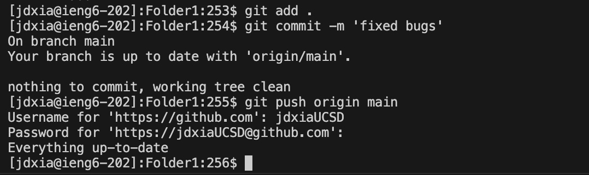

1. 
Keys Pressed: `ssh jdxia@ieng6.ucsd. edu` `<enter>`
Command SSH's to ieng6.
2. 
Keys Pressed: `git clone git@github.com:jdxiaUCSD/lab7.git NewFolder1` `<enter>`
Gets the fork of the repository and clones it into folder NewFolder1.
3. 
Keys Pressed: `cd NewFolder1` (not in screenshot)`<enter>`, `javac -cp . : lib/hamcrest-core-1.3. jar: lib/junit-4.13.2.jar *- java` `<enter>`, `java -cp .: lib/hamcrest-core-1.3.jar:lib/junit-4.13.2.jar org.ju nit. runner. JUnitCore ListExamplesTests` `<enter>`
Sets NewFolder1 as current directory, then compiles and runs tests
4. 
Keys Pressed: `vim ListExamples.java` `<enter>` `43l` `11l` `r2` `:wq` `<enter>`
Edits ListExamples.java to fix the bug.
5. 
Keys Pressed: `javac -cp . : lib/hamcrest-core-1.3. jar: lib/junit-4.13.2.jar *- java` `<enter>`, `java -cp .: lib/hamcrest-core-1.3.jar:lib/junit-4.13.2.jar org.ju nit. runner. JUnitCore ListExamplesTests` `<enter>`
Compiles and runs tests
6. 
Keys Pressed: `git add .` `<enter>` `git commit -m 'fixed bugs` `<enter>` `git push origin main` `<enter>` `jdxiaUCSD` `<cmd> + v` (password was in clipboard) `<enter>`
