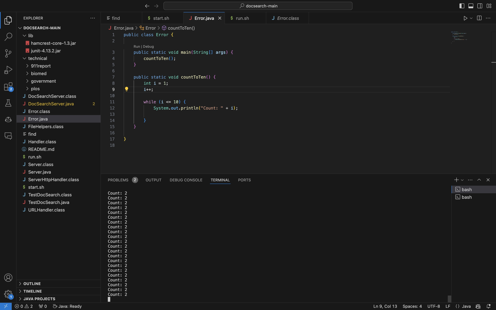
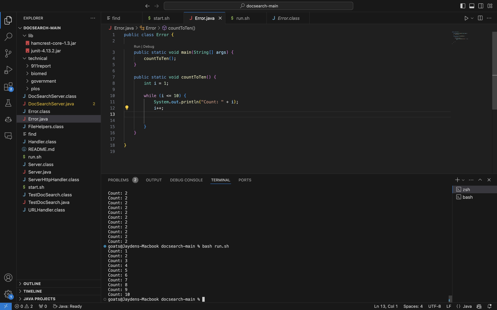

# Lab Report 5

## 1
1. Student: I'm not sure what exactly is going on--I'm trying to write a program that prints out numbers from 1-10 and I used a while loop to increment `i`, but for some reason the print output is just printing out "Count: 2". I think it's an infinite loop, but I'm pretty sure that the while loop should end the program correctly.
 

2. TA: While it's true that your while loop has a terminate statement, try to look at what within the while loop will lead the while loop statement to termination.

3. 
The bug was that in the original code, the update statement to the i++ is outside of the while loop. As such, `i` never updated, and the while loop never terminated.

4a. File Structure: I created both files--the bash file and java file--the same directory. 

b. `Error.java`:
```
public class Error {

    public static void main(String[] args) {
        countToTen();
    }

    public static void countToTen() {
        int i = 1;
        i++;

        while (i <= 10) {
            System.out.println("Count: " + i);


        }
    }
    
}
```

`run.sh`:
```
javac Error.java
java Error.java
```
c. `bash run.sh`

d. To fix the bug, move `i++` to the line after the `System.out.println("Count: " + i);` in Error.java.

## 2: Reflection

I think that the most significant thing that I've learned from this lab was how to use java code to create websites. I didn't realize that one way to build websites was literally to create a java file in VSCode, which could actively parse information from the search bar to alter the output on the site. I also thought that UCSD's `ieng6` system was very interesting and I would love to look more into it to find applications beyond what we covered in lab.

